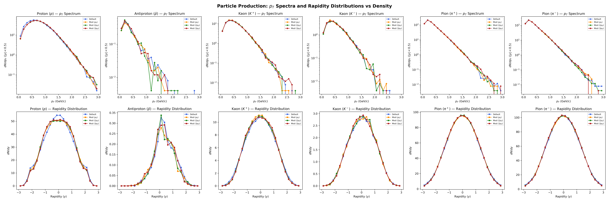
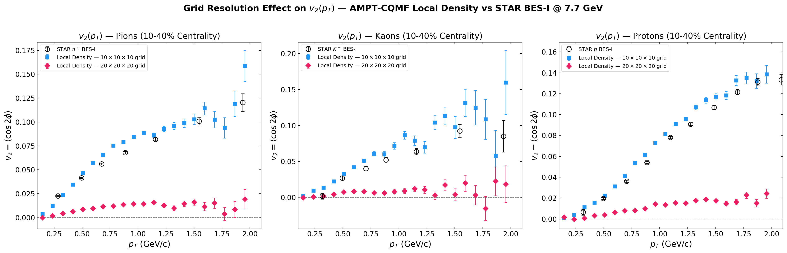

# AMPT with CQMF Medium Modifications

## Overview
This repository hosts a modified version of the **A Multi-Phase Transport (AMPT)** model (Version 1.26t9/2.26t9).

Standard AMPT's partonic cascade module (ZPC - Zhang's Parton Cascade) employs fixed, flavor-independent constituent quark masses for all partonic interactions. This heavily simplifies the in-medium evolution of the Quark-Gluon Plasma (QGP), especially at lower collision energies ($\sqrt{s_{NN}} \sim 7.7$ GeV) corresponding to the RHIC Beam Energy Scan (BES), where the fireball possesses a high baryon chemical potential ($\mu_B$).

In this major modification, we implement a **Fixed Uniform Medium Density Scan** (or Fixed-$\rho$ scan). We introduce **baryon density-dependent, flavor-specific quark masses** ($m_u, m_d, m_s$) derived from a **Chiral SU(3) Quark Mean Field (CQMF)** model directly into the ZPC scattering kernel. This phenomenological fixed-density approximation applies the effective masses and vector potentials uniformly across the entire partonic cascade for a given target density.

### What does this accomplish?
By mapping the CQMF effective constituent masses to the partons during their pQCD scatterings inside ZPC, the momentum transfers ($\hat{t}$ Mandelstam variables) and cross-sections naturally reflect the chiral symmetry restoring scalar potentials and vector repulsion potentials present in dense nuclear matter. This explicitly splits the interactions of:
- Matter vs Antimatter ($p$ vs $\bar{p}$)
- Strange vs Antistrange ($K^+$ vs $K^-$)
- Isospin asymmetric regimes ($u$ vs $d$)

## Theoretical Motivation & Citations
At finite baryonic densities, the interactions of constituent quarks with background scalar ($\sigma, \zeta, \delta$) and vector ($\omega, \rho, \phi$) meson fields shift their effective masses and introduce flavor-dependent vector self-energies. These self-energies modify the effective invariant mass ($\sqrt{s_{eff}}$) available in partonic scatterings, biasing the momentum transfer for antiquarks relative to quarks. Strange quarks ($s$) couple to the $\phi$-meson field, producing distinct strangeness production ratios and $K^+/K^-$ splitting.

1. **CQMF Baseline:** D. Singh, S. Kaur, A. Kumar, and H. Dahiya, "Effect of asymmetric nuclear medium on the valence quark structure of the kaons," *Phys. Rev. D* **111**, 054001 (2025).
2. **Mean-Field Flow:** T. Song, et al., "Partonic mean-field effects on matter and antimatter elliptic flows," *arXiv:1211.5511*.

---

## Technical Source Code Modifications
All custom modifications in the source code can be searched via the `c --- CUSTOM CQMF MODIFICATION ---` marker.

### 1. The Parton Cascade (`zpc.f`)
- **`subroutine read_mass_csv()`**: A new data-ingestion routine appended to the end of `zpc.f`. It reads the desired target density from `input.density`, opens `model_data.csv`, and linearly interpolates the scalar masses ($m_u, m_d, m_s$) and vector potentials ($V_u, V_d, V_s$) for that uniform medium. These are stored globally via `common /qmcpar/` and `common /qmcvpot/`. Vector potentials are safely zero-initialized for the `iqmc=0` fallback path.
- **`subroutine inizpc()`**: We injected a call to `read_mass_csv()` at the very beginning of the partonic phase initialization.
- **`subroutine getht()`**: The main scattering kernel. It previously assumed an average global mass `xmp`. We modified the logic to load our custom CQMF masses for $u, d,$ or $s$, applying the sign-flipped vector self-energy ($+V_q$ for quarks, $-V_q$ for antiquarks) inside the kernel to calculate the effective invariant mass and $\hat{t}$ sampling distribution. The physical propagation of the parton remains strictly free-streaming (no $\nabla V$ forces); medium effects enter only through the modified scattering kinematics.

### 2. Configuration Interfaces
- **`input.density`**: A required 2-line configuration file. Line 1: `Target Baryonic Density Ratio (rho/rho_0)`. Line 2: `Toggle (1=Mod ON, 0=Default)`.
- **`model_data.csv`**: An 8-column CSV lookup table: `density, m_u, m_d, m_s, M_B, V_u, V_d, V_s`. The vector potentials are derived from the $\omega_0$, $\rho_0$, and $\phi_0$ meson mean fields using SU(3) coupling constants ($g_{\omega u} = g_v/2\sqrt{2}$, $g_{\phi s} = g_v/2$). Regenerated via `python3 build_v2_csv.py`.
- **`input.ampt`**: Pre-configured to $\sqrt{s_{NN}} = 7.7$ GeV in String Melting mode (`ISOFT=4`), with widened lifecycle constants (`NTMAX=300`) to guarantee ZPC adequately handles the dense phase dynamics.

---

## Quickstart & Compilation
1. Configure your collision geometry via `input.ampt`.
2. Configure your desired target medium density ratio via `input.density` (e.g., `1.0` or `3.0`).
3. Run the automated compile-and-execute script:
   ```bash
   chmod +x exec
   ./exec
   ```
4. Verify the output in `nohup.out`. You should see:
    ```
    === CQMF Custom Masses & Potentials Loaded ===
    Target density ratio:  1.0000
    m_u (GeV):  0.1957  V_u (GeV):  0.0746
    m_d (GeV):  0.1957  V_d (GeV):  0.0746
    m_s (GeV):  0.4538  V_s (GeV): -0.0106
    ```
5. The final heavy-ion particle track records are emitted to `ana/ampt.dat`.

---

## Automation & Data Pipeline

### `build_v2_csv.py`
Reads the raw CQMF thermodynamic field solutions from `DataAnalysis/data_fields_18_oct/file_eta0_T0_fs3.txt` (which includes the $\phi$-meson field) and computes the proper vector potentials using the SU(3) coupling constants from `Parameteric.py`. Outputs `model_data.csv`.

### `run_data_production.sh`
Full orchestration script: compiles the binary, spawns 4 parallel AMPT jobs (Default, $\rho_0$, $2\rho_0$, $3\rho_0$), collects outputs into `ana/`, and runs all plotting scripts. Includes an explicit binary existence check to prevent silent failures.

---

## Phenomenological Analysis Scripts
We provide a comprehensive suite of Python analysis scripts to extract high-profile heavy-ion observables directly from the `ampt.dat` output files. These are pre-written to handle parallel datasets (e.g., comparing Default AMPT against CQMF modifications across a density scan).

### `plot_ratios.py`
Parses total counts for $\pi^\pm, K^\pm, p, \bar{p}$ and plots comparative particle ratios.
- **Physics Target:** Strangeness Enhancement ($K^+/\pi^+$) and Antimatter Suppression ($\bar{p}/\pi^-$).

### `plot_pt_spectra.py`
Extracts and normalizes transverse momentum ($p_T = \sqrt{p_x^2 + p_y^2}$) histograms for Pions and Kaons.
- **Physics Target:** Kinematic hardening and thermalization shifts resulting from lighter constituent partonic masses.

### `plot_v1_v2.py`
Calculates the spatial anisotropies transferred to momentum space:
* **Directed Flow ($v_1 = \langle p_x/p_T \rangle$)**: Mapped against Rapidity ($y$) for Protons. Captures the asymmetry introduced by vector self-energy modifications to the scattering kinematics.
* **Elliptic Flow ($v_2 = \langle (p_x^2 - p_y^2)/p_T^2 \rangle$)**: Mapped against $p_T$ for Pions.

### `plot_extra_observables.py`
A heavyweight script extracting four advanced observables required for high-tier literature:
1. **$v_2$ Splitting ($\Delta v_2$)**: Plots $v_2(K^+) - v_2(K^-)$. Quantifies the effect of flavor-dependent vector self-energies on the differential scattering kinematics of strange vs antistrange quarks.
2. **$dN/dy$ Spectra**: Maps proton rapidity density, demonstrating baryon stopping.
3. **Mid-Rapidity Flow Slope ($dv_1/dy|_{y=0}$)**: Extracts the linear slope of Directed flow, a direct proxy for the compressibility of the Equation of State (EOS).
4. **Transverse Mass Spectra**: Plots invariant yields against $(m_T - m_0)$ to visualize radial expansion velocity.

### `plot_advanced_baryon_stopping.py`
Plots three rapidity-dependent observables testing the vector potential directly:
1. **Net-Proton $dN/dy$**: $(p - \bar{p})$ vs rapidity — baryon stopping profile.
2. **$\bar{p}/p$ Ratio vs $y$**: Antimatter/matter asymmetry arising from the sign-flip of vector self-energies in partonic scattering.
3. **$K^+/K^-$ Ratio vs $y$**: Strangeness asymmetry from the $\phi$-field vector self-energy coupling to $s$-quarks.

### `plot_advanced_splittings.py`
Proton vs antiproton elliptic flow splitting ($\Delta v_2 = v_2(p) - v_2(\bar{p})$ vs $p_T$) — a key STAR BES observable sensitive to vector self-energy effects on partonic scattering kinematics.

### `plot_proton_kaon_production.py`
Comprehensive 2×6 panel: $p_T$ spectra (top) and rapidity distributions (bottom) for all 6 key species ($p, \bar{p}, K^+, K^-, \pi^+, \pi^-$) across all density configurations. Pions serve as the control group.

---

## Final Phenomenological Results

The following plots showcase the phenomenological results from our full multi-density scan (`Default`, `$1\rho_0$`, `$2\rho_0$`, `$3\rho_0$`) with CQMF effective masses and vector self-energies applied to the partonic scattering kernel.

### 1. Vector Self-Energy Matter-Antimatter Splittings
The sign-flip of vector self-energies for quarks vs antiquarks ($+V_q$ vs $-V_q$) modifies the effective $\hat{t}$ sampling, producing a measurable proton vs antiproton elliptic flow splitting ($\Delta v_2$).


### 2. Baryon Stopping and Net-Proton Profiles
The $\omega_0$ vector self-energy biases the effective scattering kinematics differently for protons and antiprotons, modifying their rapidity distributions relative to the default AMPT baseline.


### 3. Advanced Vector Flow Profiling 
Density-dependent responses in Directed Flow $v_1$ (capturing phase softening logic) alongside comprehensive invariant spectra normalizations.


### 4. Transverse Momentum & Particle Ratios


### 5. Flow ($v_1$ vs $v_2$) Kinematics


### 6. Species-Resolved Production
$p_T$ spectra and rapidity distributions for all six key hadron species, demonstrating selective medium effects on baryons and kaons while pions remain stable.


### 7. Grid Resolution Effects on Mean-Field Flow
A fundamental test of the Particle-in-Cell (PIC) mean-field approximation. Increasing the spatial grid resolution from $10^3$ to $20^3$ cells causes the number of partons per cell to drop to $\mathcal{O}(1)$. This introduces dominant stochastic noise into the density field, producing random, localized potential gradients that wash out the collective expansion and suppress $v_2$. This explicitly demonstrates that a coarser $10^3$ grid is physically required to maintain the macroscopic thermodynamics necessary for mean-field dynamics in small collision systems at BES energies.

