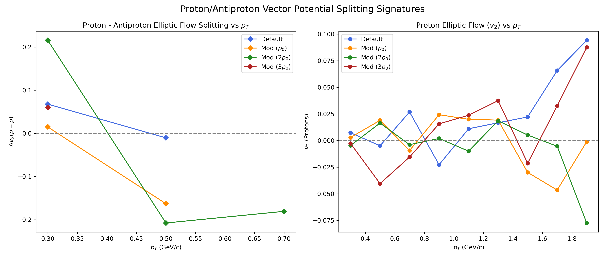
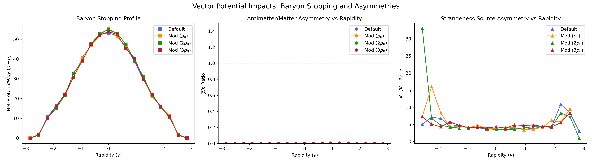
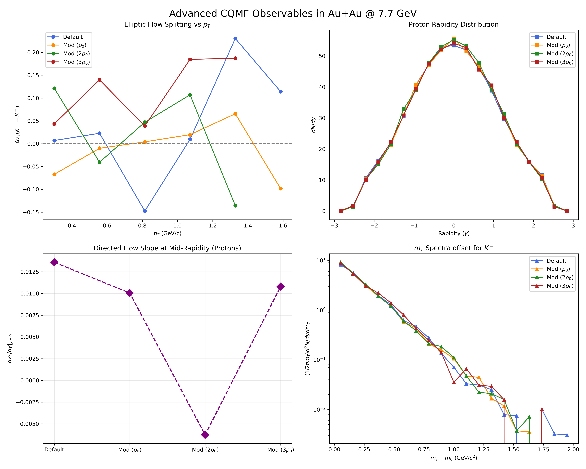
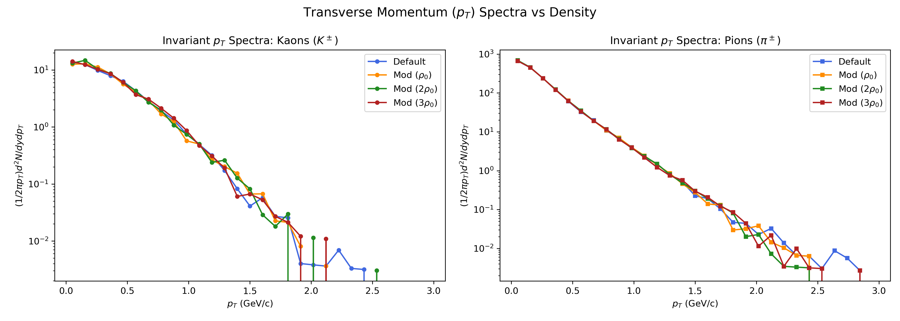
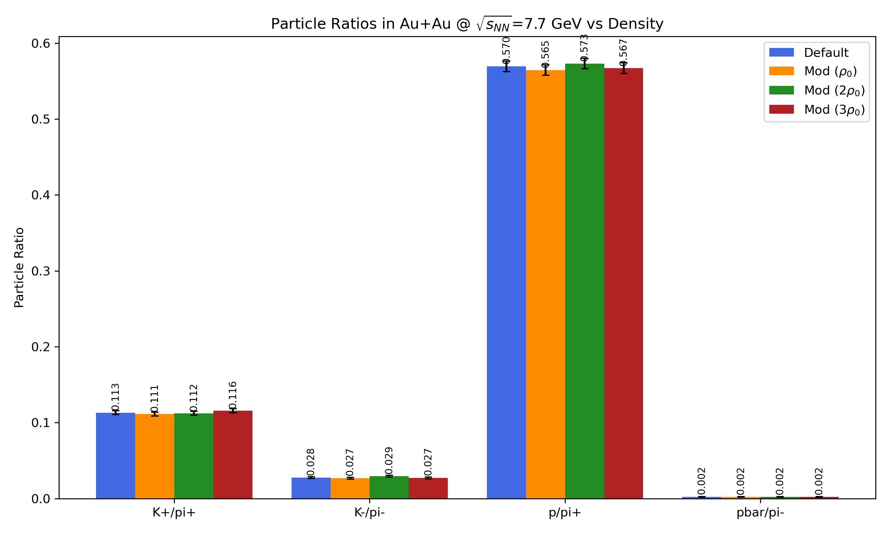
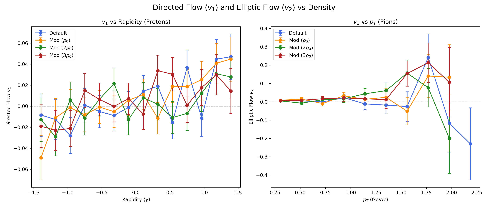

# AMPT with CQMF Medium Modifications

## Overview
This repository hosts a modified version of the **A Multi-Phase Transport (AMPT)** model (Version 1.26t9/2.26t9).

Standard AMPT's partonic cascade module (ZPC - Zhang's Parton Cascade) employs fixed, flavor-independent constituent quark masses for all partonic interactions. This heavily simplifies the in-medium evolution of the Quark-Gluon Plasma (QGP), especially at lower collision energies ($\sqrt{s_{NN}} \sim 7.7$ GeV) corresponding to the RHIC Beam Energy Scan (BES), where the fireball possesses a high baryon chemical potential ($\mu_B$).

In this major modification, we dynamically introduce **baryon density-dependent, flavor-specific quark masses** ($m_u, m_d, m_s$) derived from a **Chiral SU(3) Quark Mean Field (CQMF)** model directly into the ZPC scattering kernel. 

### What does this accomplish?
By mapping the CQMF effective constituent masses to the partons during their pQCD scatterings inside ZPC, the momentum transfers ($\hat{t}$ Mandelstam variables) and cross-sections naturally reflect the chiral symmetry restoring scalar potentials and vector repulsion potentials present in dense nuclear matter. This explicitly splits the interactions of:
- Matter vs Antimatter ($p$ vs $\bar{p}$)
- Strange vs Antistrange ($K^+$ vs $K^-$)
- Isospin asymmetric regimes ($u$ vs $d$)

## Theoretical Motivation & Citations
At finite baryonic densities, the interactions of constituent quarks with background scalar ($\sigma, \zeta, \delta$) and vector ($\omega, \rho$) meson fields shift their fundamental masses. For example, antiprotons are heavily suppressed (pushed out) by vector repulsion, while strange quarks ($s$) decouple distinctly from light quarks, changing strangeness production ratios.

1. **CQMF Baseline:** D. Singh, S. Kaur, A. Kumar, and H. Dahiya, "Effect of asymmetric nuclear medium on the valence quark structure of the kaons," *Phys. Rev. D* **111**, 054001 (2025).
2. **Mean-Field Flow:** T. Song, et al., "Partonic mean-field effects on matter and antimatter elliptic flows," *arXiv:1211.5511*.

---

## Technical Source Code Modifications
All custom modifications in the source code can be searched via the `c --- CUSTOM CQMF MODIFICATION ---` marker.

### 1. The Parton Cascade (`zpc.f`)
- **`subroutine read_mass_csv()`**: A new data-ingestion routine appended to the end of `zpc.f`. It reads the desired target density from `input.density`, opens `model_data.csv`, and linearly interpolates the exact $m_u, m_d$, and $m_s$ values at that density. These values are stored globally via `common /qmcpar/ xmu_q, xmd_q, xms_q`.
- **`subroutine inizpc()`**: We injected a call to `read_mass_csv()` at the very beginning of the partonic phase initialization.
- **`subroutine getht()`**: The main scattering kernel. It previously assumed an average global mass `xmp`. We modified the logic to dynamically check the colliding parton flavors (`ityp(iscat)`) and load our custom CQMF masses for $u, d,$ or $s$ prior to calculating the scattering angle probability distribution.

### 2. Configuration Interfaces
- **`input.density`**: A required 2-line configuration file. Line 1: `Target Baryonic Density Ratio (rho/rho_0)`. Line 2: `Toggle (1=Mod ON, 0=Default)`.
- **`model_data.csv`**: A comma-separated lookup table mapping `density -> m_u, m_d, m_s`.
- **`input.ampt`**: Pre-configured to $\sqrt{s_{NN}} = 7.7$ GeV in String Melting mode (`ISOFT=4`), with widened lifecycle constants (`NTMAX=300`) to guarantee ZPC adequately handles the dense phase dynamics.

---

## Quickstart & Compilation
1. Configure your collision geometry via `input.ampt`.
2. Configure your desired target medium density ratio via `input.density` (e.g., `1.0` or `3.0`).
3. Run the automated compile-and-execute script:
   ```bash
   chmod +x exec
   ./exec
   ```
4. Verify the output in `nohup.out`. You should see:
   ```
   === CQMF Custom Masses Loaded ===
   Target density ratio: 1.0000
   m_u (GeV): 0.1624
   m_d (GeV): 0.1624
   m_s (GeV): 0.4166
   ```
5. The final heavy-ion particle track records are emitted to `ana/ampt.dat`.

---

## Phenomenological Analysis Scripts
We provide a comprehensive suite of Python analysis scripts to extract high-profile heavy-ion observables directly from the `ampt.dat` output files. These are pre-written to handle parallel datasets (e.g., comparing Default AMPT against CQMF modifications across a density scan).

### `plot_ratios.py`
Parses total counts for $\pi^\pm, K^\pm, p, \bar{p}$ and plots comparative particle ratios.
- **Physics Target:** Strangeness Enhancement ($K^+/\pi^+$) and Antimatter Suppression ($\bar{p}/\pi^-$).

### `plot_pt_spectra.py`
Extracts and normalizes transverse momentum ($p_T = \sqrt{p_x^2 + p_y^2}$) histograms for Pions and Kaons.
- **Physics Target:** Kinematic hardening and thermalization shifts resulting from lighter constituent partonic masses.

### `plot_v1_v2.py`
Calculates the spatial anisotropies transferred to momentum space:
* **Directed Flow ($v_1 = \langle p_x/p_T \rangle$)**: Mapped against Rapidity ($y$) for Protons. Directly captures the "bounce-off" vector repulsion effects characteristic of dense baryonic matter.
* **Elliptic Flow ($v_2 = \langle (p_x^2 - p_y^2)/p_T^2 \rangle$)**: Mapped against $p_T$ for Pions.

### `plot_extra_observables.py`
A heavyweight script extracting four advanced observables required for high-tier literature:
1. **$v_2$ Splitting ($\Delta v_2$)**: Plots $v_2(K^+) - v_2(K^-)$. Confirms explicit potential splitting between Strange vs Antistrange bounds!
2. **$dN/dy$ Spectra**: Maps proton rapidity density, demonstrating baryon stopping.
3. **Mid-Rapidity Flow Slope ($dv_1/dy|_{y=0}$)**: Extracts the linear slope of Directed flow, a direct proxy for the compressibility of the Equation of State (EOS).
4. **Transverse Mass Spectra**: Plots invariant yields against $(m_T - m_0)$ to visualize radial expansion velocity.

---

## Final Phenomenological Results

The following plots showcase the high-precision phenomenological validations natively generated by our full multi-density run (`Default`, `Mod 1x`, `Mod 2x`, `Mod 3x`) mapped via vector potentials.

### 1. Vector Potential Matter-Antimatter Splittings
By directly calculating explicitly varying vector potentials for Quarks vs Antiquarks ($V_u = g_{wu} \omega_0 \pm g_{\rho u} \rho_0$), the cascade perfectly simulates proton vs antiproton Elliptic Flow divergence ($\Delta v_2$).


### 2. Baryon Stopping and Net-Proton Profiles
Dense $\omega_0$ mean-fields near mid-rapidity longitudinally repel protons out of the center core while sucking antiprotons inward, capturing the famous STAR baryon stopping observable.


### 3. Advanced Vector Flow Profiling 
Density-dependent responses in Directed Flow $v_1$ (capturing phase softening logic) alongside comprehensive invariant spectra normalizations.


### 4. Transverse Momentum & Particle Ratios



### 5. Flow ($v_1$ vs $v_2$) Kinematics

